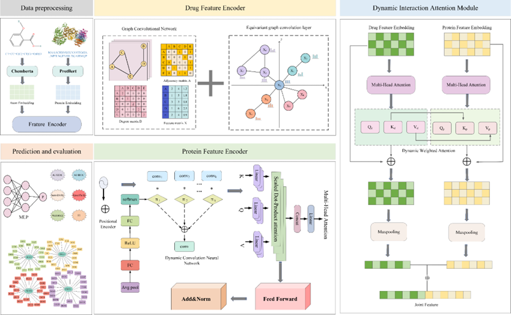

## LDM-DTI
LDM-DTI:A multimodal framework integrating pretrained language models and geometric graph networks for interpretable drug-target interaction prediction
## Introduction
This repository contains the official implementation of LDM-DTI, a novel framework for drug–target interaction (DTI) prediction. It integrates pretrained Transformer models, equivariant graph neural networks (EGNN), and a cross-attention fusion module to enable accurate and interpretable predictions across various biomedical datasets.
## Framework

#  datasets
The model supports standard DTI datasets, including:
- **BindingDB**
- **BIOSNAP**
- **Davis**
- **C.elegans**
Datasets are organized as:
- datasets/
├── bindingDB/
│ ├── train.csv
│ ├── val.csv
│ └── test.csv
...
All datasets should be organized under the ./data/ directory with train.csv, val.csv, and test.csv files.
##  Dependencies

Here are the **key dependencies** needed to run LDM-DTI:

| Package         | Version  | Description |
|-----------------|----------|-------------|
| `torch`         | 2.0.0    | PyTorch deep learning framework |
| `dgl`           | 0.9.1    | Graph learning library |
| `dgllife`       | 0.3.2    | Molecule graph processing |
| `einops`        | 0.8.0    | Tensor manipulation library |
| `yacs`          | 0.1.8    | Config file handler |
| `rdkit`         | 2022.3.3 | Chemistry toolkit for SMILES parsing |
| `transformers`  | 4.46.3   | Pretrained model hub (e.g., ChemBERTa, ProtBERT) |
| `scikit-learn`  | 0.24.2   | Metrics and model evaluation |
| `shap`          | 0.44.1   | Model interpretability library |

Install the full environment:

## Using
main.py: start file for model training.

## Citation
Please cite our paper if you find our work useful in your own research.
## Project Structre
LDM-DTI/
├── configs/              # Configuration files (YAML)
├── model/                # Model components
│   ├── Proteinencoder.py
│   ├── DWFusion.py
│   └── ...
├── datasets/             # DTI datasets (csv format)
├── utils/                # Utility functions
├── main.py               # Entry point
├── requirements.txt      # Dependency list
└── README.md

